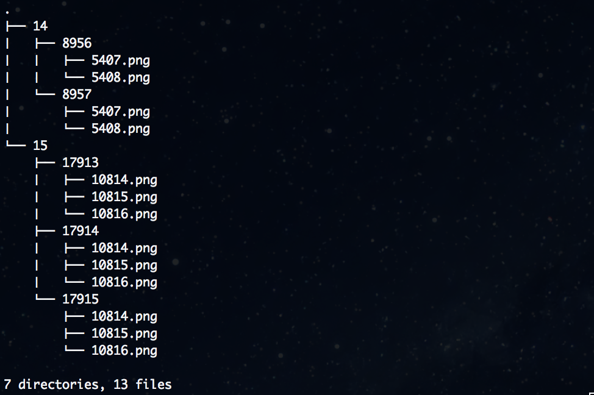

[](https://goreportcard.com/report/github.com/Luqqk/wms-tiles-downloader)

## 🌐 wms-tiles-downloader

Command line application for downloading wms-tiles from given URL with specified bbox and zoom parameters.

### Installation

If you have go installed locally:

```bash
go get -u github.com/Luqqk/wms-tiles-downloader...
```
Or you can use already compiled binaries available here:

[binaries](https://github.com/Luqqk/wms-tiles-downloader/releases)

### Command Line Usage

```
Usage:

    wms-get [OPTIONS]

    Download tiles from specific source and save them on hard drive.

Options:

    --url         WMS server url.                              REQUIRED
    --layer       Layer name.                                  REQUIRED
    --zooms       Comma-separated list of zooms to download.   REQUIRED
    --bbox        Comma-separated list of bbox coordinates.    REQUIRED
    --format      Tiles format.                                DEFAULT: image/png
    --width       Tile width.                                  DEFAULT: 256
    --height      Tiles hight.                                 DEFAULT: 256
    --service     Service type.                                DEFAULT: WMS
    --version     WMS version.                                 DEFAULT: 1.1.1
    --styles      WMS styles.                                  DEFAULT: ""
    --concurrency Limit concurrent requests to the WMS server. DEFAULT: 32
                  Change only if you know what you're doing.

Help Options:

    --help    Help. Prints usage in the stdout.
```

### Examples

Get tiles from `http://129.206.228.72/cached/osm` server for specified `layer`, `zoom levels` and `bbox`.

```bash
$ wms-get --url http://129.206.228.72/cached/osm --layer osm_auto:all --zooms 14,15 --bbox 16.80,52.05,16.83,52.06
```

Command above will produce following output (tree of folders with files in z/x/y format):



### Release history

Current binaries for different versions or platforms and changelog can be found here:

* [v2.0.0](https://github.com/Luqqk/wms-tiles-downloader/releases/tag/v2.0.0)
* [v1.0.0](https://github.com/Luqqk/wms-tiles-downloader/releases/tag/v1.0.0)
